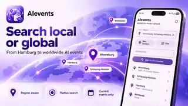
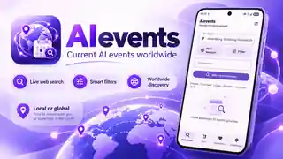

  

# AIevents

  <strong>Worldwide AI event discovery for Android.</strong> 
  Conferences · Meetups · Stammtische · Workshops · Hackathons · Webinars · Provider events

  <a href="https://github.com/chekento/AIevents-/releases/latest">Release page</a>
  &nbsp;·&nbsp;
  <a href="https://github.com/chekento/AIevents-/actions/workflows/android.yml">Build status</a>

## Current version

**AIevents v0.5.3**

AIevents is a native Android app for finding current **AI-focused events anywhere in the world**. It combines a global place search, live web discovery, a rotating central event index and a separate Provider Radar for AI/LLM ecosystems.

The app is intentionally not tied to specific cities. Ahrensburg, Hamburg, New York and other places used during development are only test cases. Search logic is generated dynamically from the selected place, country, coordinates, radius, nearby cities and local language terms.

## App preview

<table>
  <tr>
    <td width="50%"></td>
    <td width="50%"></td>
  </tr>
  <tr>
    <td width="50%"></td>
    <td width="50%"></td>
  </tr>
  <tr>
    <td width="50%"></td>
    <td width="50%"></td>
  </tr>
</table>

## Download

### Android APK

**Stable latest-download link:**

https://github.com/chekento/AIevents-/releases/latest/download/AIevents-latest.apk

Versioned APKs and SHA-256 files are available on the [GitHub Releases](https://github.com/chekento/AIevents-/releases/latest) page.

> The current public package is the tested debug APK produced by GitHub Actions from the main branch. Android may ask you to allow installation from the browser or file manager you use to open it.

Minimum Android version: **Android 8.0 / API 26**.

## Highlights

### 🌍 Worldwide Discover search

- worldwide place autocomplete
- exact latitude/longitude stored after place selection
- 5–500 km radius search
- nearby-city expansion for smaller towns
- multilingual query generation using English + app language + target-country language
- adaptive deep-search pass when initial coverage is thin
- strict geographic validation where coordinates are available
- old, cancelled and expired events filtered out
- relevance-first ranking

The Discover search panel is collapsible and automatically minimizes once a search starts, leaving most of the display available for event results.

### 🔎 Deep event discovery

AIevents searches beyond large conferences and ticketing platforms. The long-tail vocabulary includes:

- meetup / community meetup
- Stammtisch / KI-Stammtisch
- local chapter / Ortsgruppe
- user group / developer group
- club / society / association / Arbeitskreis
- seminar / research seminar / colloquium
- student group / student society
- research lab / journal club
- coworking meetup / makerspace meetup
- innovation hub / startup hub / tech hub
- workshop / webinar / symposium / congress
- panel / roundtable / fireside chat
- demo day / build day / hackathon / datathon
- bootcamp / masterclass / office hours / AMA
- livestream / launch event / roadshow / showcase
- breakfast meetup / lunch & learn / community night

AI relevance is checked separately so generic technology events with only incidental AI mentions are suppressed.

### 🛰 Provider Radar

The second tab is independent from the local Discover feed.

It monitors **240+ AI / LLM / MLOps / LLMOps ecosystems**, including categories such as:

- LLM / model providers
- AI cloud platforms
- agents and agent frameworks
- developer tools
- MLOps
- LLMOps and observability
- data infrastructure
- vector databases
- safety / evals
- voice / audio AI
- image / video AI
- enterprise AI
- communities and research

Provider controls are collapsible and event-first, so the event list receives most of the screen. Online and in-person provider events can be filtered separately.

### 📡 Source coverage

Discovery combines public search results and event-specific sources such as:

- Google, Bing and DuckDuckGo discovery
- Meetup
- Luma / lu.ma
- Eventbrite
- Partiful
- Bevy
- Sched
- Splash
- AllEvents
- Humanitix
- Ticket Tailor
- Mobilizon
- OpenCollective
- Eventfrog
- Eventfinda
- Sessionize
- Pretalx
- Devpost
- HackerEarth
- LinkedIn Events where publicly indexable
- Facebook Events where publicly indexable
- Google Developer Groups
- Microsoft Reactor
- Global AI Community
- AI Tinkerers
- MLOps Community
- LLMOps.Space
- ODSC
- AI Camp
- The AI Summit
- Data Science Salon
- MLconf
- IEEE / ACM
- provider-specific event hubs and community pages

Whenever possible, AIevents parses **schema.org/Event / JSON-LD** directly from the source page and preserves the original source URL.

### 🗺 Map

Events that publish usable coordinates can be explored on an internal OpenStreetMap view.

### ❤️ Favourites

Events can be saved locally and revisited from the Favourites tab.

### 📅 Calendar + reminders

- one-tap Android calendar insertion
- event source URL included
- optional reminders
- 1 day, 1 hour or 15 minutes before an event
- configurable background checks for newly discovered events

### 🌐 Multilingual

The interface and search logic are multilingual. Search vocabulary includes localized AI and participation terminology across many languages, including German, English, French, Spanish, Italian, Portuguese, Dutch, Polish, Czech, Turkish, Nordic languages, Japanese, Korean, Chinese, Arabic, Hindi, Indonesian, Thai, Vietnamese and Russian.

## Search architecture

AIevents uses two complementary layers:

1. **Central warm index**  
   GitHub Actions refreshes a rotating global event cache every few hours, removes past/invalid records and continuously checks provider/event hubs.

2. **Live search**  
   The Android client builds queries dynamically from the selected location, language, radius, nearby places, AI topic vocabulary and participation terminology. Results from multiple discovery paths are merged, geocoded where possible, deduplicated and ranked.

The central index is only a warm cache — **it does not limit where the app works**.

## Data quality

Each result can carry:

- confidence score
- relevance score
- distance
- source
- provider identity
- price/free status when published
- online/in-person status
- original event URL
- optional event artwork
- corroborating source count

Events with uncertain data are not silently treated as certain.

## Privacy

AIevents requires no account.

Optional device-location permission is requested only when the user explicitly chooses **My location**. Search terms and selected locations are sent only to the public discovery/geocoding services required for the requested search.

## Build

The Android workflow:

1. runs unit tests
2. builds the debug APK
3. uploads the Actions artifact
4. publishes/updates the matching GitHub Release
5. provides a stable `AIevents-latest.apk` asset

Relevant workflows:

- `.github/workflows/android.yml`
- `.github/workflows/index-events.yml`

## Tech stack

Kotlin · Jetpack Compose · Material 3 · Coroutines · DataStore · WorkManager · OkHttp · Jsoup · schema.org/Event · JSON-LD · OpenStreetMap / osmdroid · Photon · Overpass

## Repository structure

- `app/` — Android application
- `backend/` — scheduled indexer and provider/event-source catalogue
- `data/events-index.json` — generated current-event cache
- `.github/workflows/` — APK build/release and event-index automation

## Current UX

**Discover** — local/radius event search  
**Radar** — global provider and ecosystem events  
**Map** — geocoded event map  
**Favourites** — saved events  
**Options** — language, source, notification and display settings

---

Built as a worldwide, source-transparent AI event discovery app.
